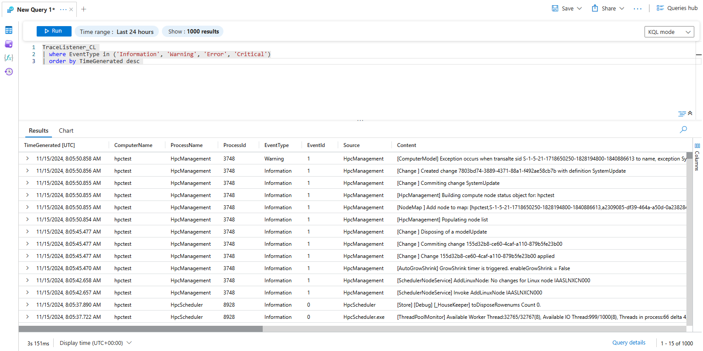

# Logging to Azure Monitor

HPC Pack templates now integrate with Azure Monitor and can make logs to it. The templates by default deploy a [Log Analytics workspace](https://learn.microsoft.com/en-us/azure/azure-monitor/logs/log-analytics-workspace-overview) (a component of Azure Monitor) with custom table and rules to collect logs from a HPC Pack cluster. With the log in Azure Monitor, it is much more convenient than ever to diagnose problems and watch the health of a HPC Pack cluster on Azure.

## Kinds of log to collect

There're two kinds of log that will be collected. The Windows Event log (Application log only) and the log by HPC Pack.

For the latter, the log is originally saved in .bin files locally in the folder `%CCP_DATA%LogFiles` (see [this document](https://github.com/Azure/hpcpack/blob/master/kb/000000_How%20to%20collect%20HPC%20Pack%20logs.md) for more about it). Now the local log files remain, while the log is also written to Azure Monitor.

## View the logs

To view the logs, firstly you need to go the the Log Analytics workspace. Find it out in the resource group where the HPC Pack cluster is in, like

Then you select the "log" from the Log Analytics workspace, like

Then you can view the Windows Event log for Application from the "Event" table, like

View the HPC Pack log from the "TraceListener_CL" table, like

You can use the [Kusto Query Language](https://learn.microsoft.com/en-us/kusto/query/?view=microsoft-fabric) to build your query, like

## VM tags for Azure Monitor

To support logging to Azure Monitor, a few VM tags are applied on VMs of a HPC Pack cluster. They have the prefix LA_:

* LA_DceUrl
* LA_DcrId
* LA_DcrStream
* LA_MiClientId
* LA_MiResId

Do not change or remove these tags on VMs, or the logging to Azure Monitor will be broken.

BTW, there're also a few VM tags for the key vault and certificate used by a HPC Pack cluster. They have the prefix KV_:

* KV_RG
* KV_Name
* KV_CertUrl
* KV_CertThumbprint

Do not change or remove them on VMs, either.